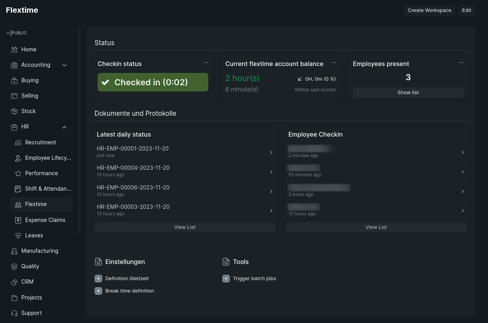

# ERPNext HR time management

HR Time management module for [ERPNext](https://erpnext.com/). 



## Features

* Flextime 
  * Easy checkin modal
  * Creation of daily status docs
  * Creation of attendance docs
  * Definition of individual time models
  * Definition of break time
  * Report for present employees

## Setup

### Requirements

This module is based on [Frappe HR module](https://github.com/frappe/hrms), which needs to be installed first.

### Installation

Install the modul as usual:
```bash
bench get-app hr_time https://github.com/atlas-aero/erpnext_hr_time
```
```bash
bench --site <site_name> install-app hr_time
```

### Configuration

#### 1. Define flextime time model

Time model is defined by "flextime definition" doc: https://erp.test.example/app/flextime-definition

Each definition is linked 1:1 to employee grade.

Per default the module ships with 40 hours monday to friday time model.

#### 2. Define break times

Enforced break times are defined by "break time definition doc": https://erp.test.example/app/break-time-definition

The module is shipped with the mandatory break times for Germany as standard.

#### 3. Assign flextime model to employees

Assign flextime model to employee:
  1. Set time model to "Flextime account"
  2. Set grade (e.g. "Standard full-time 40 hours") 

## FAQ

### How to fix wrong/missing checkin times?

1. Correct or recreate the missing/wrong checkin docs.
2. Delete all corresponding "daily flextime status" docs of all past days up to the date with the incorrect entries
3. Optional: Delete the attendance docs of the given date

The processing cronjob (runs hourly) will recalculate all missing "daily flextime status" docs.
The process can be triggered manually by using the button "Process daily flextime status": https://erp.test.example/app/trigger-hr-time-management-batch-jobs

## Development
Any form of support is greatly appreciated. Feel free to create issues and PRs. See DEVELOPMENT for more details.

### Testing

Executing unit tests:

```bash
python -m unittest discover hr_time/tests
```

#### License
Licensed under MIT license (LICENSE-MIT or http://opensource.org/licenses/MIT).
Each contributor agrees that his/her contribution covers the license.
