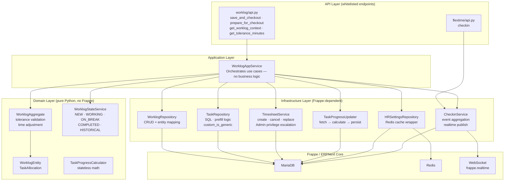
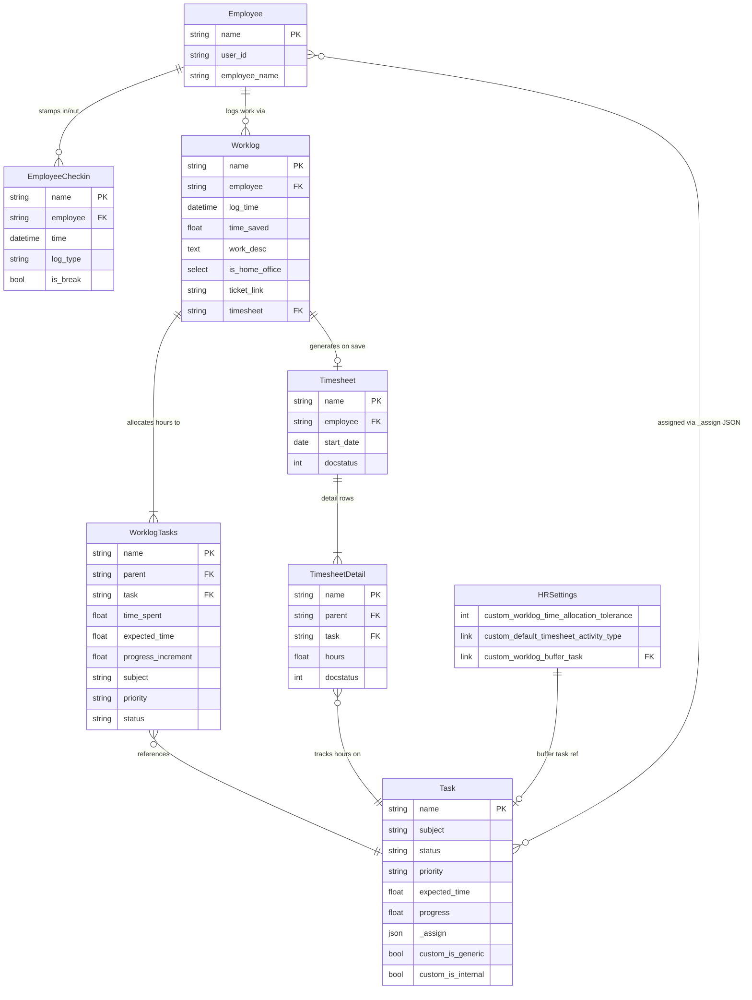
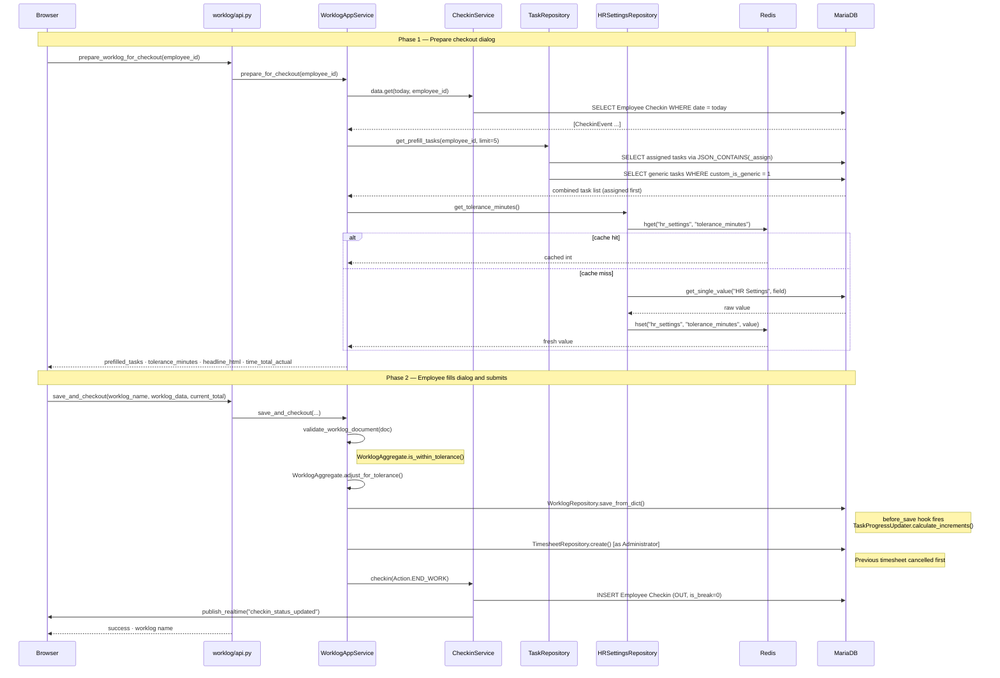
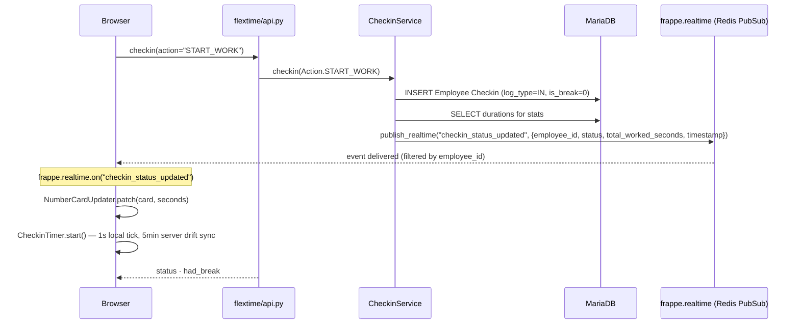
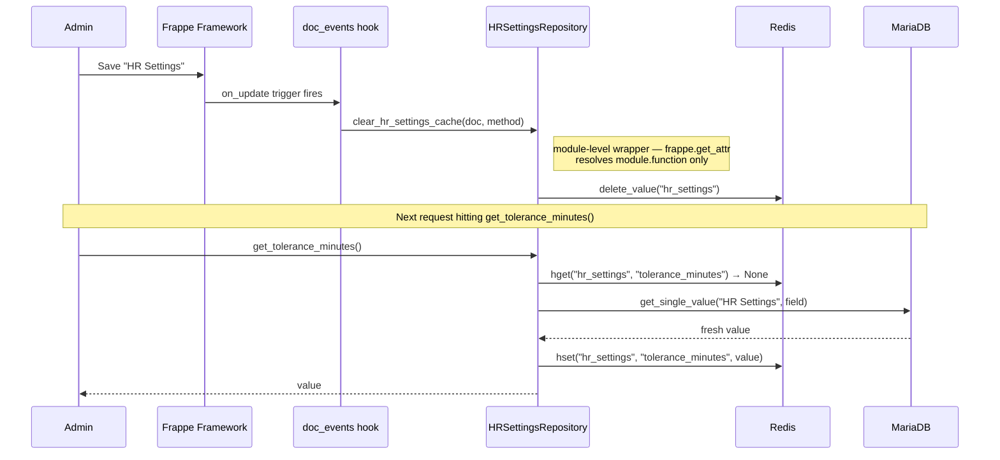

# #33 Worklog Time Accounting — Developer Reference

**Branch:** `33-worklog_time_accounting` · **Base:** `31-Worklog_HomeOffice_field` · **ERPNext ≥ 15.110**

---

## Contents

1. [Feature Overview](#1-feature-overview)
2. [DDD Architecture](#2-ddd-architecture)
3. [Data Model (ER)](#3-data-model)
4. [Checkout Flow](#4-checkout-flow)
5. [Real-time Check-in](#5-real-time-check-in)
6. [HR Settings Cache](#6-hr-settings-cache)
7. [Task Prefilling Logic](#7-task-prefilling-logic)
8. [Custom Fields Reference](#8-custom-fields-reference)
9. [Deployment Protocol](#9-deployment-protocol)
10. [Staging Fixes Log](#10-staging-fixes-log)

---

## 1. Feature Overview

This PR delivers end-to-end work time accounting on top of the existing Worklog doctype. When an employee checks out for the day, a dialog collects task allocations, validates total time against the employee's actual checked-in hours (within a configurable tolerance), and auto-generates a submitted Timesheet — all in a single action.

Alongside this, check-in status updates were migrated from a 20-second polling loop to a WebSocket push (`frappe.publish_realtime`), and the entire backend was restructured following Domain-Driven Design (DDD) principles: pure domain objects hold business rules, the application service orchestrates use cases, and all Frappe-specific I/O lives in an infrastructure layer.

**Design constraints:**
- **One worklog per workday** — CRUD on the same document; the checkout dialog upserts today's entry.
- **One timesheet per worklog** — previous timesheet is cancelled and replaced on every worklog update.
- **Overallocation within tolerance** — if total allocated hours exceed actual work by ≤ tolerance, `time_saved` is stretched to match allocation (not capped at actual hours).
- **Admin privilege escalation for timesheets** — users do not need direct Timesheet create/submit permissions; `TimesheetRepository` escalates to Administrator and restores the session user in a `finally` block.

---

## 2. DDD Architecture



| Layer | Rule |
|---|---|
| API | `@frappe.whitelist()` only. No business logic. |
| Application | Orchestrates; coordinates domain + infra. No Frappe DB calls. Houses `WORKLOG_STATE_COLORS` — presentation mapping belongs here, not in the domain enum. |
| Domain | Pure Python. No `import frappe`. Business invariants live in the **aggregate**, not the entity. |
| Infrastructure | All DB/Redis/WebSocket I/O. Maps Frappe docs ↔ domain entities. |

### Domain object responsibilities

| Object | Responsibility |
|---|---|
| `WorklogEntity` | Pure data holder. Fields + `total_allocated` property only. No methods that encode business rules. |
| `WorklogAggregate` | Aggregate root. Owns `is_within_tolerance()` and `adjust_for_tolerance()`. Enforces the invariant that time adjustment logic cannot be bypassed by working directly on the entity. |
| `WorklogStateService` | Stateless domain service. Maps checkin events → `WorklogState` enum (NEW / WORKING / ON_BREAK / COMPLETED / HISTORICAL). Determines editability. |
| `WorklogState` (enum) | State values only — no display logic. Colors live in `WORKLOG_STATE_COLORS` in the application layer. |

---

## 3. Data Model

> Custom doctypes: **Worklog**, **Worklog Tasks**. All others are ERPNext core doctypes extended with custom fields.



### Worklog fields

| Field | Type | Notes |
|---|---|---|
| `employee` | Link → Employee | Set on create; not editable after |
| `log_time` | Datetime | Anchors worklog to a workday — one doc per day enforced at app level |
| `time_saved` | Float (hrs) | Set by `WorklogAggregate.adjust_for_tolerance()` on save |
| `tasks_entry` | Table → Worklog Tasks | Child table; replaces deprecated `task` link field |
| `timesheet` | Link → Timesheet | Populated after auto-creation; replaced on each save |
| `is_home_office` | Select (Yes/No) | Mandatory — validation throws if blank |
| `task` | Link → Task | **Deprecated** — hidden, kept for schema compatibility |

### Worklog Tasks (child doctype) fields

| Field | Type | Notes |
|---|---|---|
| `task` | Link → Task | ERPNext Task being worked on |
| `time_spent` | Float (hrs) | Hours allocated to this task in this worklog |
| `expected_time` | Float (hrs) | Fetched from Task; used for progress calculation |
| `progress_increment` | Percent | `time_spent / expected_time × 100`, capped at 100 |
| `subject`, `status`, `priority` | Data (fetch) | Denormalized from Task for fast list rendering |

---

## 4. Checkout Flow



---

## 5. Real-time Check-in

Replaces the previous 20-second polling loop. The server emits `checkin_status_updated` immediately after any check-in action; the browser listener updates the navbar timer and dashboard number cards without a page refresh.



**Frontend components:**

| Class / File | Responsibility |
|---|---|
| `CheckinTimer` | Local timer with drift correction. Handles IN / BREAK / OUT states. Syncs with server every 5 min. **Race condition guard:** if a realtime OUT event is received while a drift sync is in-flight, the stale sync response is discarded — prevents the timer from restarting after checkout. |
| `CHECKIN_STATUS` constants | Single source of truth for status → `{label, icon, CSS class}` mapping. |
| `TimeFormatter` | Formats seconds as `HH:MM`; `formatWithDuration` for richer display. |
| `NumberCardUpdater` | Direct DOM patch on Frappe number cards — patches value only, preserving card UI state. |

---

## 6. HR Settings Cache

HR Settings values (tolerance, activity type, buffer task) are cached in Redis under a single hash key `"hr_settings"`. An `on_update` doc event invalidates the entire hash whenever an admin saves HR Settings.

> **Frappe hook resolution constraint:** `frappe.get_attr()` splits on the last dot only — it cannot resolve `module.Class.method`. The hook must point to a module-level function, not a static method on the class.



```python
# hooks.py
doc_events = {
    "HR Settings": {
        "on_update": "hr_time.api.hr_settings.repository.clear_hr_settings_cache"
    }
}

# repository.py — module-level wrapper required for frappe.get_attr resolution
def clear_hr_settings_cache(doc=None, method=None) -> None:
    HRSettingsRepository.clear_cache()
```

---

## 7. Task Prefilling Logic

`TaskRepository.get_prefill_tasks(employee_id, limit=5)` combines two sorted sublists, filling up to `limit` slots:

| Priority | Source | Filter |
|---|---|---|
| 1st (up to `limit`) | Assigned tasks | `JSON_CONTAINS(_assign, user_id)` AND `custom_is_generic != 1` |
| Remaining slots | Generic tasks | `custom_is_generic = 1` |

Both sublists are excluded from internal tasks (`custom_is_internal = 1`) — this prevents the Worklog Buffer task from appearing in the dialog.

**Sort order (applied to both sublists):**

| Order | Column | Direction |
|---|---|---|
| 1st (optional) | `priority` | Urgent → High → Medium → Low via `FIELD(priority, ...)` |
| 2nd | `exp_start_date` | Soonest first; NULLs last |
| 3rd | `modified` | Most recent first (tiebreaker) |

---

## 8. Custom Fields Reference

All custom fields are provisioned via `hr_time/fixtures/custom_field.json` and applied with `bench migrate`.

### Task (ERPNext core)

| Field | Type | Description |
|---|---|---|
| `custom_is_generic` | Check | Marks task as generic/routine (Meetings, Housework). Eligible for prefill without assignment. Replaces the deprecated `is_generic` field removed in ERPNext 15.110. |
| `custom_is_internal` | Check | Marks system/internal tasks (e.g. Worklog Buffer). Hidden from prefill regardless of assignment. |

### HR Settings (Single doctype)

| Field | Type | Default | Description |
|---|---|---|---|
| `custom_worklog_time_allocation_tolerance` | Int | `0` | Minutes of allowed over/under-allocation. `0` = strict mode (no tolerance). Admin sets explicitly. |
| `custom_default_timesheet_activity_type` | Link → Activity Type | `"Task"` | Activity type written to every Timesheet Detail row. |
| `custom_worklog_buffer_task` | Link → Task | auto-created | Task that absorbs unallocated time when employee under-allocates within tolerance. Auto-created on first access if not set; persisted back to HR Settings immediately. |

> **Note:** The `"default"` property in a Custom Field fixture only applies to *new* documents. For Single doctypes like HR Settings, the existing singleton row is never backfilled by `bench migrate`. Set values explicitly in the HR Settings UI after first install, or in `after_install` if a non-null default is required programmatically.

---

## 9. Deployment Notes

The notes below cover the one-time configuration required after the first deploy of this feature.

### Staging one-time setup (after first deploy)

1. Open **HR Settings** → set **Worklog Buffer Task** (pick the auto-created "Worklog Buffer" task)
2. Set **Worklog Time Allocation Tolerance** to desired minutes (e.g. 30)
3. Set **Default Timesheet Activity Type** (e.g. "Task")
4. Save — triggers the `on_update` hook and primes the Redis cache

---

## 10. Post-merge Fixes Log

### DDD layer refinements (post-PR cleanup)

After initial PR review, three structural issues were identified and corrected without schema changes:

| Issue | Location | Fix |
|---|---|---|
| Self-instantiation in `before_save_worklog` | `WorklogAppService` | Was creating a new `WorklogAppService()` instance inside a method on `self`, then calling `app.validate_worklog_document(doc)` on the new instance. Fixed to call `self.validate_worklog_document(doc)` directly. |
| Business logic on entity instead of aggregate | `WorklogEntity` / `WorklogAggregate` | `is_within_tolerance()` and `adjusted_time_saved()` lived on `WorklogEntity`, with `WorklogAggregate` only delegating. Moved implementation to aggregate; entity is now a pure data holder. |
| UI concern (`display_color`) in domain enum | `WorklogState` | `display_color()` method was on the domain enum, coupling color strings to domain objects. Removed; replaced with `WORKLOG_STATE_COLORS` dict in `WorklogAppService` (application layer). All callers (`api.py`, `worklog_app_service.py`) updated to use the dict. |

### Multi-tab realtime race condition fix

**Symptom:** After checkout in Tab 1, Tab 2's navbar timer could continue running (showing a larger elapsed time) instead of switching to "Checked out" state.

**Root cause:** The 5-minute drift correction fires `CheckinTimer.sync()` which sends an async `frappe.call`. If the checkout's realtime OUT event arrives and correctly stops the timer *while that sync call is still in-flight*, the sync callback returns with a stale `{status: "IN"}` response and inadvertently restarts the timer.

**Fix:** `CheckinTimer.sync()` now checks whether the current status has already moved to OUT before applying the sync response. If so, the stale response is silently discarded.

```js
// checkin_timer.js — sync() callback guard
if (this.status === CHECKIN_STATUS.OUT.key &&
    response.message.status !== CHECKIN_STATUS.OUT.key) {
    return; // discard stale IN response — realtime event already committed the checkout
}
```